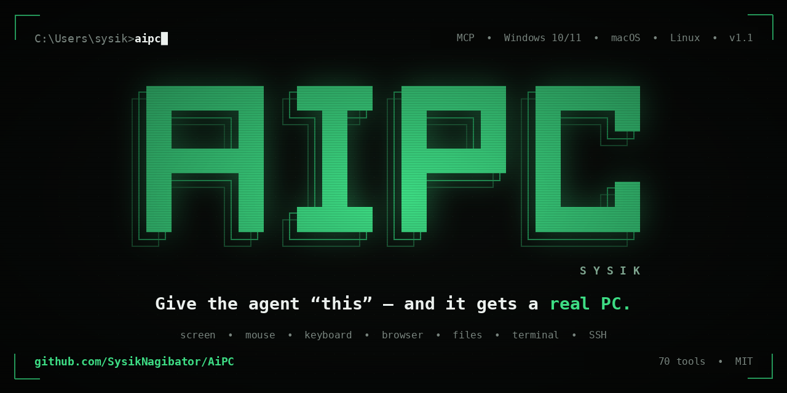
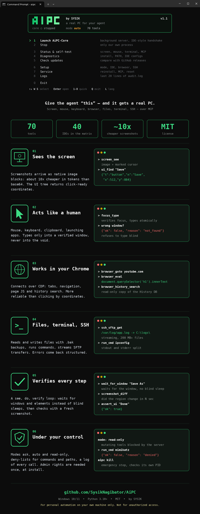
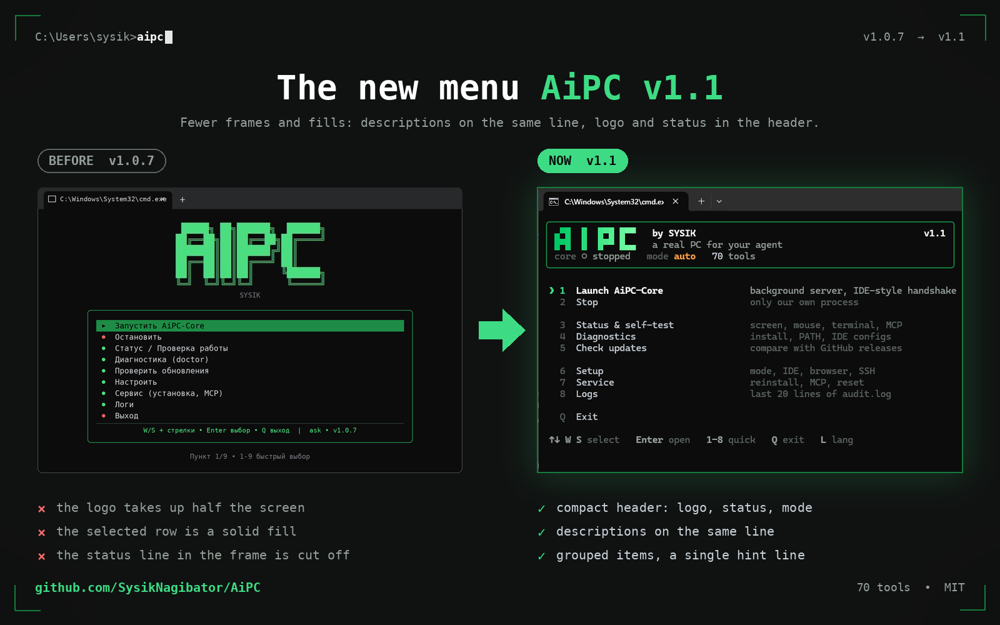

<p align="center">
  
</p>

<h1 align="center">AiPC by SYSIK</h1>

<h1 align="center">This tool is for personal automation and testing on your own machine. Do not use it for unauthorized access.</h1>

<p align="center">
  <b>Give the agent "this" — and it gets a real PC.</b><br>
  Screen, mouse, keyboard, your browser, files, terminal, SSH — via the model's native tools.
</p>

<p align="center">
  <a href="https://github.com/SysikNagibator/AiPC/releases"></a>
  
  
  
  
</p>

<p align="center">
  <b>RU README: <a href="README_RU.md">Russian version</a></b> · Skills: <a href="SKILL.md">SKILL.md</a> · IDE matrix: <a href="docs/IDES.md">docs/IDES.md</a>
</p>

<div align="center">
  <video src="https://github.com/user-attachments/assets/7cd96d2e-84bc-418c-90c8-cc13f923b69f" data-canonical-src="https://github.com/user-attachments/assets/7cd96d2e-84bc-418c-90c8-cc13f923b69f" controls="controls" width="640"></video><br>
  <b>Video overview</b> · <a href="https://github.com/user-attachments/assets/7cd96d2e-84bc-418c-90c8-cc13f923b69f">direct link</a>
</div>

---

## Contents

- [What it is](#what-it-is)
- [Why AiPC](#why-aipc)
- [Read this first: risks](#read-this-first-risks)
- [Quick start](#quick-start)
- [The `aipc` menu](#the-aipc-menu)
- [70 tools](#70-tools-for-the-model)
- [Token efficiency](#token-efficiency)
- [MCP connection](#mcp-connection)
- [Self-update](#self-update)
- [Safety](#safety)
- [What can go wrong](#what-can-go-wrong)
- [Troubleshooting](#troubleshooting)
- [Project structure](#project-structure)
- [Build from source](#build-from-source)
- [License](#license)

---

## What it is

**AiPC** is a local service + console utility that gives any AI agent full access
to your computer over the open **MCP** (Model Context Protocol) standard.

```
[ Agent in any IDE ] --MCP/stdio--> [ AiPC-Core: one local service ]
                                            |
        +------------------+----------------+------------------+
        |                  |                |                  |
      Vision            Control          Browser           System/Net
   screenshots,      mouse+keyboard,  your Chrome via    files, terminal,
   UI tree,           apps,            CDP + history,     processes, SSH,
   windows            clipboard        JS eval           search, sysinfo
```

The agent stops being "text in a chat" and starts working like a human at the PC:
it looks at the monitor, clicks, types, opens apps, googles in **your** browser,
runs commands, uses SSH — and verifies every step with a new screenshot.

If a model says "I have no computer access", the built-in system prompt
(`aipc/server.py:SYSTEM_PROMPT`, also served as the `aipc_instructions` MCP prompt)
tells it to use the tools when they are available — or honestly say what's missing.

## Why AiPC

<p align="center">
  
</p>

| Usual agent limits | With AiPC |
|--------------------|-----------|
| Blind: no screen | `screen_see` — screenshot as a native image block, cursor marked |
| Clicks by guessing | `ui_snapshot` / `ui_find` — ready-made x/y coordinates (0–1000) |
| Typing into the void | `focus_type` — verified focus + atomic typing; refuses to type blind |
| Sleeps and hopes | `wait_for_window` / `wait_for_ui_element` / `wait_for_change` |
| "Did it work?" unknown | `screenshot_diff`, `assert_ui`, `logs_tail`, `audit.log` |
| No machine access | Files, terminal, processes, SSH/SFTP, browser, clipboard |
| Token burn on screenshots | Native image blocks (~65 chars + image vs 55K chars of base64) |

---

## Read this first: risks

AiPC gives an AI model **real control over your PC**: it sees the screen,
moves the mouse, types, runs terminal commands, reads files, uses SSH.
That is the point — and the risk.

- Keep the default `ask` mode: the server shows **you** a Yes/No dialog for
  every dangerous action. The model cannot click "Yes" for you.
- Never switch to `auto` for tasks involving strangers' files, links or
  email attachments — prompt injection is real (see `docs/THREAT_MODEL.md`).
- Know the kill switch: `aipc panic` or **Ctrl+Alt+Shift+K** freezes everything.
- This tool is for **your own machine** (see the note at the top).

---

## Quick start

**Windows:** download **`AiPC_Win_1.1.exe`** from [Releases](https://github.com/SysikNagibator/AiPC/releases) and double-click it.

| Step | What to do |
|------|------------|
| 1 | On first run it **sets everything up itself**: asks for admin once (UAC) → copies itself to `C:\Program Files\AiPC\` → adds the `aipc` command to PATH → opens the menu (MCP registration into IDEs is **explicit**: `aipc install --ide cursor` or menu → Settings → Connect IDE) |
| 2 | In your IDE refresh MCP servers (Refresh / restart) and give the agent a plain-language task |

**macOS / Linux:** binaries come from the same [Releases](https://github.com/SysikNagibator/AiPC/releases) page (`AiPC_macOS_*`, `AiPC_Linux_*`), or install from source:

```
pip install git+https://github.com/SysikNagibator/AiPC.git   # or: pipx install git+https://github.com/SysikNagibator/AiPC.git
aipc mcp                 # MCP command for your IDE
aipc install --dry-run   # preview IDE changes before applying
```

> The exe above is just the convenient bundle. On macOS grant Accessibility + Screen Recording when asked; on Linux prefer an X11 session (Wayland blocks synthetic input) — details in `docs/PLATFORM.md`.

Example tasks:

```
look at my screen, what is this error?
open YouTube and find a review of ...
connect via SSH to 192.168.1.10 and fetch yesterday's log
```

Works with any tool-capable 2026 model: `claude-opus-5-5`, `gpt-6-astra`,
`gpt-6-sol` / `luna`, `gemini-3.8-flash`, `claude-fable-5-1`.

---

## The `aipc` menu

<p align="center">
  
</p>

Open a regular `cmd` and type `aipc`. One `rich.Live` frame in an alternate
buffer, redrawn only on events — no flicker, no leftover lines. A rounded card
holds the logo, slogan and status (`core ● running`, mode, tools count);
below it a frameless numbered list with inline descriptions, groups split by
blank lines, the `❯` marker on the selection (danger items turn red when
selected, no fills anywhere). One dim footer line with the keys.
Controls: **W/S**, arrows **↑/↓**, **Home/End**, **Enter** open, digits 1–8
quick select, **Q** exit, **L** toggles language (wraps around the edges).
Russian layout works by key position. Themes: green/mono/amber
(Setup → Theme), `NO_COLOR` and ASCII fallback respected. Narrow windows hide
descriptions automatically; a background check notifies about new releases.

| Item | What it does |
|------|--------------|
| Launch AiPC-Core | Background server, IDE-style handshake |
| Stop | Only our own process |
| Status & self-test | Screen, mouse, terminal, MCP |
| Diagnostics | Install, PATH, IDE configs |
| Check updates | Compare with GitHub releases |
| Setup | Mode `ask/auto/read-only`, IDE, browser (CDP flag), SSH hosts, language, theme |
| Service | Reinstall + PATH, reconfigure MCP, kill Core, where-am-I info |
| Logs | Last 20 lines of `audit.log` |
| Exit | — |

No menu at hand? Same actions as commands:
`aipc update`, `aipc doctor`, `aipc kill`, `aipc keys` (keyboard diagnostics),
`aipc status`, `aipc selftest`, `aipc setup`, `aipc install`, `aipc mcp`.

---

## 70 tools for the model

**Vision (18):** `screen_see`, `screen_region`, `screen_burst`, `window_shot`, `pixel_color`, `ui_snapshot` (active window by default:
0.69s / 17 nodes vs 1.7s / 200 desktop), `ui_find`, `assert_ui`, `windows_list`,
`window_focus` (verified), `window_manage`, `window_find`, `get_active_window`,
`wait_for_window`, `wait_for_ui_element`, `wait_for_change`, `screenshot_diff`, `screen_info`.

**Mouse & keyboard (19):** `mouse_move/click/drag/double_click/right_click/middle_click`, `mouse_position`
(drag with ctrl/shift/alt), `scroll`, `type_text` (auto-chunked, Cyrillic-safe),
`press_key`, `key_down/up`, `clipboard_set/get` (+images), `sleep`, `open_app`,
`focus_type` (verified focus + atomic type — the only correct way to type).

**Browser (6):** `browser_tabs`, `browser_goto`, `browser_eval` (JS via CDP —
more reliable than coordinate clicks), `browser_active_tab`, `browser_close_tab`,
`browser_history_search` (read-only copy of the History DB).

**Files & system (13):** `fs_list/read/write/find/stat/mkdir/delete/move`
(atomic writes + `.bak`, binary guard, pagination, deny-lists),
`run_cmd` (split stdout/stderr, Russian OEM decoding, deny-list),
`process_list/find`, `wait_for_process`, `download_file` (streamed, no size cap).

**Network & machine (7):** `web_search_pc`, `ssh_exec`, `ssh_sftp_get/put`
(200 MB+ friendly streaming), `sys_info` (battery/memory/CPU/disks),
`net_check`, `env_get` (refuses secret-like names).

**Human & debug (4):** `notify_user` (popup, non-blocking), `ask_user` (Yes/No,
blocks for a human decision), `aipc_status`, `logs_tail`.

**Audio (1):** `audio_listen` (loopback — system sound, or mic; 1-30 s, WAV,
native audio block or saved file).

**Video (2):** `video_info` (duration/size/fps/codec), `video_frames`
(1-12 frames as image blocks — watch a clip frame by frame).

Agent loop: **see (`screen_see`) → do → re-see to verify**.
Errors are structural: `{"ok": false, "reason": "not_found|timeout|denied|..."}`.
Every call runs exactly once, serialized; every call lands in `~/.aipc/audit.log`
(2 MB rotation).

## Token efficiency

- Screenshots travel as **native MCP image blocks**: ~65 chars of JSON + image
  instead of ~55K chars of base64 text (~10x cheaper per screenshot).
  `raw=true` returns legacy base64 if a client can't render images.
- UI nodes are compact: `{"t","n","x","y"}` instead of long keys.
- `ui_snapshot` defaults to the active window; role/name filters cut tokens further.
- Prefer search over listing: `ui_find` / `window_find` / `fs_find` / `process_find`.
- All tool descriptions fit in one short line.
- **Profiles** (`aipc mcp --profile ...`): `minimal` (12 tools: see→do→verify
  loop), `browser` (20 tools: + web), `full` (70, default). Measured tool-schema
  size: full ~12.9K chars, browser ~3.8K, minimal ~2.5K (**−81%** vs full).

---

## MCP connection

AiPC registers itself on every menu launch (19 configs across 14 IDE families).
Manual reference format:

```json
{
  "mcpServers": {
    "aipc": {
      "command": "C:\\Program Files\\AiPC\\AiPC_Win_1.1.exe",
      "args": ["mcp"]
    }
  }
}
```

Full 40-IDE matrix (auto / preset / bridge): [docs/IDES.md](docs/IDES.md).
Ready-made files: [mcp_presets/](mcp_presets/). Skill-style install: [SKILL.md](SKILL.md).

Cloud IDEs without localhost access (Claude.ai, Manus, Devin, Bolt, v0, Lovable,
Replit…) can't reach `127.0.0.1` — see the "Bridge" section in `docs/IDES.md`.

## Self-update

Menu → "Check updates" (or `aipc update`): compares with the latest GitHub release,
shows the changelog, and only with your explicit **Yes** downloads and reinstalls
itself (UAC). Version is always visible in the menu title; `aipc doctor` flags
a stale install in Program Files.

---

## Safety

| Mode | File writes/deletes | Commands/SSH | Typing in password managers | Who decides |
|------|--------------------|--------------|------------------------------|-------------|
| `ask` (default) | popup to YOU | popup to YOU | popup to YOU | human, every time |
| `auto` | allowed | allowed | allowed | model (except after untrusted input — taint-guard asks) |
| `read-only` | blocked server-side | blocked server-side | blocked server-side | nobody |

- Modes: `ask` (default — the **server** pops a Yes/No dialog to YOU for every
  file-write/delete, command, SSH, download, browser-JS call; the model cannot
  bypass it; silence for 120 s = denied), `auto` (no dialogs),
  `read-only` (all mutating tools blocked **server-side**, not just by prompt).
- Risk classes: every tool is tagged `read/interact/mutate/exec/network`
  (`policy.TOOL_RISK`). read-only passes only `read`; ask confirms
  `mutate/exec/network`; typing/clicking inside password-manager, crypto-wallet
  or banking windows also asks. The dialog offers time choices — once,
  10 min, 1 hour (`safety.allow_presets`) — never forever.
- **Honest note:** deny-lists only *reduce* risk, they are not a security
  boundary (obfuscation always evolves). The real boundary is modes +
  server-side confirmations. For strict setups use `run_cmd_policy: allowlist`
  — only listed command prefixes run, everything else asks.
- Admin rights needed **once** — copying into Program Files + writing PATH.
- Deny-lists for commands (mimikatz, ransomware patterns, encoded PowerShell,
  quotes/`^`/env-var/chain-obfuscation normalized) and paths (browser secrets,
  private keys, hives, `System32`) live in `~/.aipc/config.yaml` and **auto-upgrade**
  (`safety.version`) without wiping your additions. Paths inside `run_cmd`
  (`type ...\Login Data`) are checked too.
- Typing goes only into a **verified** foreground window (`focus_type`).
- Secrets guard: `env_get` refuses `*KEY/*TOKEN/*SECRET/*PASSWORD*` names.
- Emergency stop: menu → Stop, or `aipc kill` (verifies the PID is ours first).

---

## What can go wrong

- **Prompt injection**: a web page, document or chat message tells the agent
  to delete/send/run something. Mitigations: `untrusted` markers, taint-guard
  confirmations, `ask` by default. Still — read the confirmation dialogs.
- **Wrong window, wrong click**: the agent acts on what it sees; a changed
  layout means a wrong button. `focus_type` refuses to type blind, but stay
  nearby for destructive tasks.
- **Update without signature**: `aipc update` downloads an exe checked only
  for the MZ header. Don't update over hostile networks.
- **Secrets in context**: the agent may paste a token it read into chat.
  `audit.log`, `env_get` and `fs_read` mask known patterns; everything else
  is your eyes on the screen.

Full version: [`docs/THREAT_MODEL.md`](docs/THREAT_MODEL.md).

---

## Troubleshooting

| Symptom | Fix |
|---------|-----|
| Model says "no PC access" | Reconnect MCP (Refresh / restart IDE), remind: "you have aipc.* tools, start with screen_see" |
| Menu doesn't respond to keys | Run `aipc keys`, press W/S/arrows/Enter/Esc — paste the 5 lines to us |
| `aipc` command unknown | Open a **new** cmd (PATH applies to new shells); reinstall via `dist\aipc.exe` |
| Right wall of the menu drifts | Update: frames render only via fixed-width `rich.Panel` since 1.0.4.4 |
| Chrome tabs invisible | Menu → Setup → Browser (adds `--remote-debugging-port=9222`), restart Chrome |
| Old version in Program Files | `aipc doctor` tells you; run fresh `dist\AiPC_Win_1.1.exe` → UAC → updated |
| MCP not in IDE | Run `aipc install --list-ides`, then `aipc install --ide cursor` (or `--all`); preview with `--dry-run` |
| Remove AiPC | `aipc uninstall` (removes our MCP entries, PATH, Program Files copy; `--yes` for scripts) |
| GitHub page/API 404s or rate-limits | Wait a minute and retry; check your token scopes and proxy; if the outage persists, open an issue with the timestamp |

---

## Project structure

```
AiPC/
  aipc/            # server.py (MCP) · vision/control/os_ops/browser/net/sysinfo
                   # notify · installer (self-install + 19 IDE configs)
                   # maintenance (update/doctor/kill) · menu · policy/audit
  mcp_presets/     # ready-made MCP configs (16 files)
  assets/          # logo (AiPC_Logo.svg/png) + app icons: AiPC.ico (Windows),
                   # AiPC.icns (macOS) — visible on light and dark themes;
                   # AiPC_promo*.mp4 — video overviews (EN/RU) for README
  tools/           # build_exe.bat · build_icon.py · sign.bat · version_info.txt
  tests/           # pytest: policy, installer merge, server (19 tests)
  docs/            # IDES.md (40 IDEs) · SIGNING.md (SmartScreen)
  SKILL.md         # one-file skill install · CHANGELOG.md · LICENSE (MIT)
```

---

## Build from source

```bat
python -m pip install -r requirements.txt
python -m pytest tests -q
python -m aipc selftest
tools\build_exe.bat
```

Output: `dist\AiPC_Win_1.1.exe` (~36 MB, icon + publisher version-info) and `dist\AiPC-Setup.exe`.
Signing away the blue SmartScreen: see [docs/SIGNING.md](docs/SIGNING.md) (needs
a code-signing certificate: Certum Open Source ~€25/yr is the cheapest start).

---

## License

MIT. Author — SYSIK. See [LICENSE](LICENSE).
