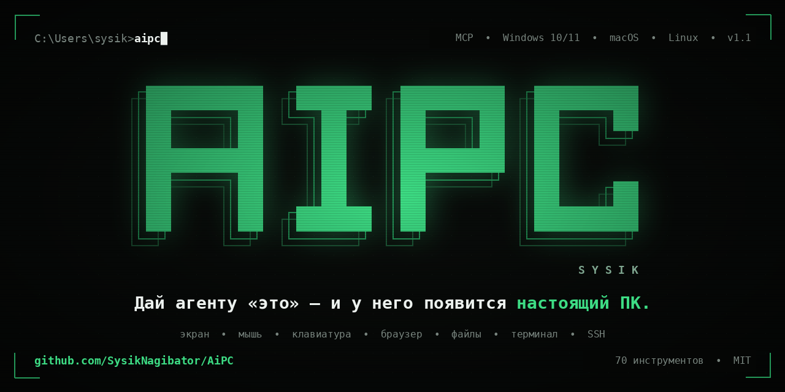
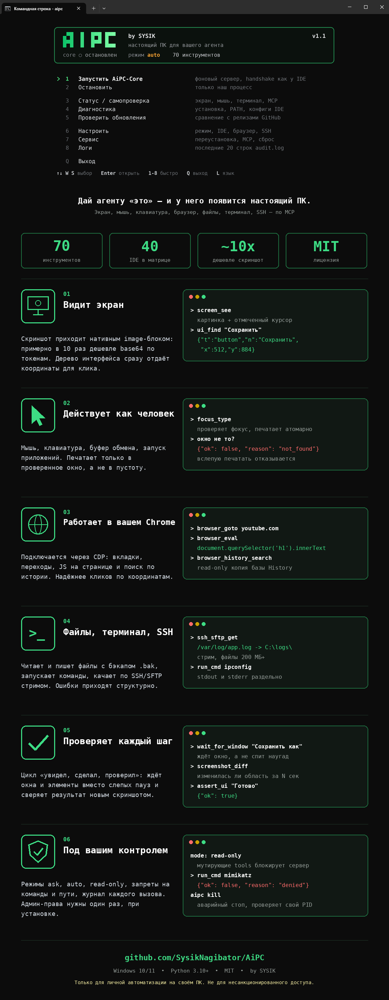
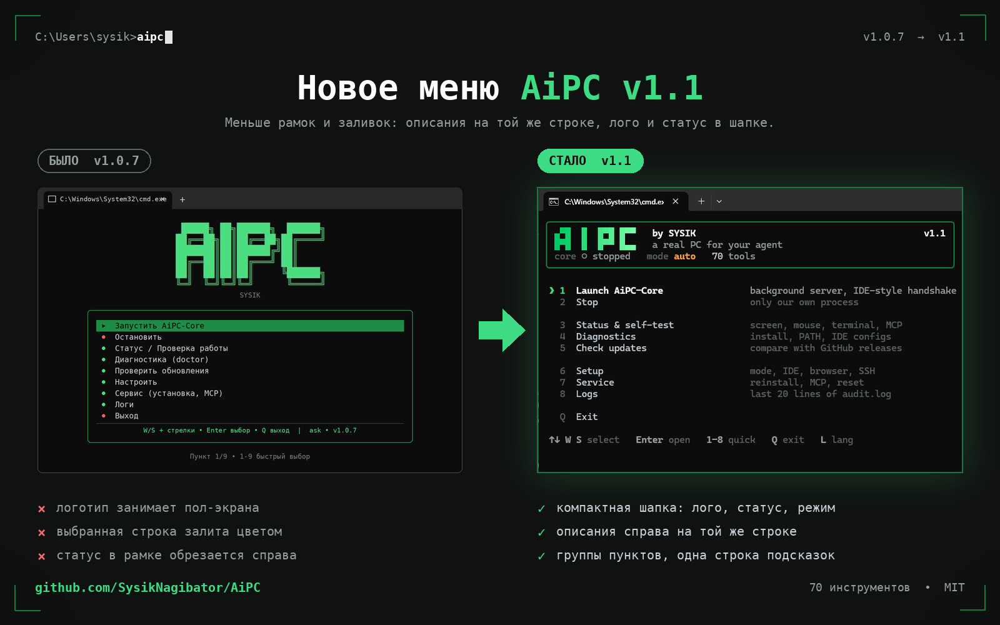

<p align="center">
  
</p>

<h1 align="center">AiPC by SYSIK</h1>

<p align="center">
  <b>Дайте агенту «это» — и у него появится настоящий ПК.</b><br>
  Экран, мышь, клавиатура, ваш браузер, файлы, терминал, SSH — через нативные инструменты модели.
</p>

<p align="center">
  <a href="https://github.com/SysikNagibator/AiPC/releases"></a>
  
  
  
  
</p>

<p align="center">
  <b>EN README: <a href="README.md">English version</a></b> · Скиллы: <a href="SKILL_RU.md">SKILL.md</a> · IDE матриции: <a href="docs/IDES_RU.md">docs/IDES.md</a>
</p>

<div align="center">
  <video src="https://github.com/user-attachments/assets/216933a9-e7f0-4126-8e8a-35b2f66343eb" data-canonical-src="https://github.com/user-attachments/assets/216933a9-e7f0-4126-8e8a-35b2f66343eb" controls="controls" width="640"></video><br>
  <b>Видеообзор</b> · <a href="https://github.com/user-attachments/assets/216933a9-e7f0-4126-8e8a-35b2f66343eb">прямая ссылка</a>
</div>

---

## Содержание

- [Что это](#что-это)
- [Почему AiPC](#почему-aipc)
- [Сначала прочитай: риски](#сначала-прочитай-риски)
- [Быстрый старт](#быстрый-старт)
- [Меню `aipc`](#меню-aipc)
- [70 инструментов](#70-инструмента-для-модели)
- [Экономия токенов](#экономия-токенов)
- [Подключение MCP](#подключение-mcp)
- [Самообновление](#самообновление)
- [Безопасность](#безопасность)
- [Что может пойти не так](#что-может-пойти-не-так)
- [Решение проблем](#решение-проблем)
- [Структура проекта](#структура-проекта)
- [Сборка из исходников](#сборка-из-исходников)
- [Лицензия](#лицензия)

---

## Что это

**AiPC** — это локальный сервис + консольная утилита, которая даёт любому ИИ-агенту полный доступ
к вашему компьютеру через открытый стандарт **MCP** (Model Context Protocol).

```
[ Агент в любой IDE ] --MCP/stdio--> [ AiPC-Core: один локальный сервис ]
                                            |
        +------------------+----------------+------------------+
        |                  |                |                  |
      Зрение            Управление       Браузер           Система/Сеть
   скриншоты,        мышь+клавиатура,  ваш Chrome через   файлы, терминал,
   дерево UI,         приложения,       CDP + история,     процессы, SSH,
   окна               буфер обмена      JS eval           поиск, sysinfo
```

Агент перестаёт быть «текстом в чате» и начинает работать как человек за ПК:
смотрит на монитор, кликает, печатает, открывает приложения, гуглит в **вашем** браузере,
выполняет команды, использует SSH — и проверяет каждый шаг новым скриншотом.

Если модель говорит «у меня нет доступа к компьютеру», встроенный системный промпт
(`aipc/server.py:SYSTEM_PROMPT`, также отдаётся как MCP-промпт `aipc_instructions`)
велит ей использовать инструменты, когда они доступны — или честно сказать, чего не хватает.

## Почему AiPC

<p align="center">
  
</p>

| Обычные ограничения агента | С AiPC |
|--------------------|-----------|
| Слепой: нет экрана | `screen_see` — скриншот как нативный image-блок, курсор отмечен |
| Клики наугад | `ui_snapshot` / `ui_find` — готовые координаты x/y (0–1000) |
| Печать в пустоту | `focus_type` — проверенный фокус + атомарный ввод; отказывается печатать вслепую |
| Спит и надеется | `wait_for_window` / `wait_for_ui_element` / `wait_for_change` |
| «Сработало?» неизвестно | `screenshot_diff`, `assert_ui`, `logs_tail`, `audit.log` |
| Нет доступа к машине | Файлы, терминал, процессы, SSH/SFTP, браузер, буфер обмена |
| Трата токенов на скриншоты | Нативные image-блоки (~65 символов + изображение против 55K символов base64) |

---

## Сначала прочитай: риски

AiPC даёт ИИ-агенту **настоящее управление твоим ПК**: он видит экран,
двигает мышь, печатает, выполняет команды терминала, читает файлы, ходит по SSH.
В этом суть — и в этом риск.

- Держи режим `ask` по умолчанию: сервер показывает окно Да/Нет **тебе**
  на каждое опасное действие. Модель нажать «Да» за тебя не может.
- Не включай `auto` для задач с чужими файлами, ссылками и вложениями —
  prompt-инъекции реальны (см. `docs/THREAT_MODEL_RU.md`).
- Знай аварийный стоп: `aipc panic` или **Ctrl+Alt+Shift+K** замораживает всё.
- Инструмент — для **своего** компьютера.

---

## Быстрый старт

**Windows:** скачайте **`AiPC_Win_1.1.1.exe`** из [Releases](https://github.com/SysikNagibator/AiPC/releases) и запустите двойным щелчком.

| Шаг | Что делать |
|------|------------|
| 1 | При первом запуске он **всё настроит сам**: запросит админа один раз (UAC) → скопирует себя в `C:\Program Files\AiPC\` → добавит команду `aipc` в PATH → откроет меню (регистрация MCP в IDE — **явная**: `aipc install --ide cursor` или меню → Настроить → Подключить IDE) |
| 2 | В вашей IDE обновите MCP-серверы (Refresh / перезапуск) и дайте агенту задачу на простом языке |

**macOS / Linux:** бинарники на той же странице [Releases](https://github.com/SysikNagibator/AiPC/releases) (`AiPC_macOS_*`, `AiPC_Linux_*`), либо установка из исходников:

```
npm i -g aipc-sysik   # проще всего: сам скачает бинарь под твою ОС
# или: pip install aipc-sysik
# или: pipx install aipc-sysik
aipc mcp                 # MCP-команда для IDE
aipc install --dry-run   # предпросмотр изменений перед применением
```

> Exe выше — просто удобный бандл. На macOS выдайте Accessibility + Screen Recording по запросу; на Linux лучше X11-сессия (Wayland режет синтетический ввод) — детали в `docs/PLATFORM_RU.md`.

Примеры задач:

```
посмотри на мой экран, что это за ошибка?
открой YouTube и найди обзор на ...
подключись по SSH к 192.168.1.10 и вытащи вчерашний лог
```

Работает с любой моделью 2026 года, поддерживающей инструменты: `claude-opus-5-5`, `gpt-6-astra`,
`gpt-6-sol` / `luna`, `gemini-3.8-flash`, `claude-fable-5-1`.

---

## Меню `aipc`

<p align="center">
  
</p>

Откройте обычный `cmd` и введите `aipc`. Один кадр `rich.Live` в альтернативном
буфере, перерисовка только по событиям — без мерцания и остатков строк.
Скруглённая карточка с логотипом, слоганом и статусом (`core ● running`,
режим, число инструментов); под ней нумерованный список без рамки с описаниями
в строке, группы через пустые строки, маркер `❯` на выбранном (опасные
краснеют при выборе, заливок нет). Внизу одна приглушённая строка клавиш.
Управление: **W/S**, стрелки **↑/↓**, **Home/End**, **Enter** открыть, цифры 1–8
быстрый выбор, **Q** выход, **L** смена языка (цикличность через край). Русская
раскладка работает по позиции клавиш. Темы: green/mono/amber
(Настроить → Тема), уважаются `NO_COLOR` и ASCII-фолбэк. В узких окнах описания
скрываются автоматически; фоновая проверка сообщает о новых релизах.

| Пункт | Что делает |
|------|--------------|
| Запустить AiPC-Core | Фоновый сервер, проверка как у IDE |
| Остановить | Только свой процесс |
| Статус и самотест | Экран, мышь, терминал, MCP |
| Диагностика | Установка, PATH, конфиги IDE |
| Обновления | Сверка с релизами GitHub |
| Настройка | Режим `ask/auto/read-only`, IDE, браузер (флаг CDP), SSH-хосты, язык, тема |
| Сервис | Переустановка + PATH, перенастройка MCP, убить Core, информация где-я |
| Логи | Последние 20 строк `audit.log` |
| Выход | — |

Нет меню под рукой? Те же действия командами:
`aipc update`, `aipc doctor`, `aipc kill`, `aipc keys` (диагностика клавиатуры),
`aipc status`, `aipc selftest`, `aipc setup`, `aipc install`, `aipc mcp`.

---

## 70 инструментов для модели

**Зрение (18):** `screen_see`, `screen_region`, `screen_burst`, `window_shot`, `pixel_color`, `ui_snapshot` (по умолчанию активное окно:
0.69с / 17 узлов против 1.7с / 200 рабочих столов), `ui_find`, `assert_ui`, `windows_list`,
`window_focus` (проверенный), `window_manage`, `window_find`, `get_active_window`,
`wait_for_window`, `wait_for_ui_element`, `wait_for_change`, `screenshot_diff`, `screen_info`.

**Мышь и клавиатура (19):** `mouse_move/click/drag/double_click/right_click/middle_click`, `mouse_position`
(перетаскивание с ctrl/shift/alt), `scroll`, `type_text` (авторазбивка, безопасно для кириллицы),
`press_key`, `key_down/up`, `clipboard_set/get` (+изображения), `sleep`, `open_app`,
`focus_type` (проверенный фокус + атомарный ввод — единственный правильный способ печати).

**Браузер (6):** `browser_tabs`, `browser_goto`, `browser_eval` (JS через CDP —
надёжнее кликов по координатам), `browser_active_tab`, `browser_close_tab`,
`browser_history_search` (копия БД History только для чтения).

**Файлы и система (13):** `fs_list/read/write/find/stat/mkdir/delete/move`
(атомарная запись + `.bak`, защита от бинарников, пагинация, deny-листы),
`run_cmd` (раздельные stdout/stderr, декодирование русской OEM, deny-лист),
`process_list/find`, `wait_for_process`, `download_file` (потоково, без ограничения размера).

**Сеть и машина (7):** `web_search_pc`, `ssh_exec`, `ssh_sftp_get/put`
(дружелюбно к потокам 200 МБ+), `sys_info` (батарея/память/CPU/диски),
`net_check`, `env_get` (отказывается от имён, похожих на секреты).

**Человек и отладка (4):** `notify_user` (всплывающее окно, не блокирует), `ask_user` (Да/Нет,
блокирует для решения человека), `aipc_status`, `logs_tail`.

**Звук (1):** `audio_listen` (loopback — системный звук, или микрофон; 1-30 с, WAV,
нативный аудио-блок или сохранение в файл).

**Видео (2):** `video_info` (длительность/размер/fps/кодек), `video_frames`
(1-12 кадров image-блоками — смотреть ролик покадрово).

Цикл агента: **увидеть (`screen_see`) → сделать → снова увидеть для проверки**.
Ошибки структурны: `{"ok": false, "reason": "not_found|timeout|denied|..."}`.
Каждый вызов выполняется ровно один раз, сериализованно; каждый вызов попадает в `~/.aipc/audit.log`
(ротация 2 МБ).

## Экономия токенов

- Скриншоты передаются как **нативные MCP image-блоки**: ~65 символов JSON + изображение
  вместо ~55K символов base64-текста (~10x дешевле за скриншот).
  `raw=true` возвращает устаревший base64, если клиент не умеет отображать изображения.
- Узлы UI компактны: `{"t","n","x","y"}` вместо длинных ключей.
- `ui_snapshot` по умолчанию берёт активное окно; фильтры по роли/имени ещё больше режут токены.
- Предпочитайте поиск перечислению: `ui_find` / `window_find` / `fs_find` / `process_find`.
- Все описания инструментов укладываются в одну короткую строку.
- **Профили** (`aipc mcp --profile ...`): `minimal` (12 инструментов: цикл
  увидел→сделал→проверил), `browser` (20 инструментов: + веб), `full` (70,
  по умолчанию). Замер размера схем: full ~12.9K символов, browser ~3.8K,
  minimal ~2.5K (**−81%** от full).

---

## Подключение MCP

AiPC регистрирует себя при каждом запуске меню (19 конфигов в 14 семействах IDE).
Ручной формат для справки:

```json
{
  "mcpServers": {
    "aipc": {
      "command": "C:\\Program Files\\AiPC\\AiPC_Win_1.1.1.exe",
      "args": ["mcp"]
    }
  }
}
```

Полная матрица 40 IDE (авто / пресет / мост): [docs/IDES.md](docs/IDES.md).
Готовые файлы: [mcp_presets/](mcp_presets/). Установка в стиле skill: [SKILL.md](SKILL.md).

Облачные IDE без доступа к localhost (Claude.ai, Manus, Devin, Bolt, v0, Lovable,
Replit…) не могут достучаться до `127.0.0.1` — см. раздел «Bridge» в `docs/IDES.md`.

## Самообновление

Меню → «Проверить обновления» (или `aipc update`): сравнивает с последним релизом GitHub,
показывает changelog и только после вашего явного **Да** скачивает и переустанавливает
себя (UAC). Версия всегда видна в заголовке меню; `aipc doctor` помечает
устаревшую установку в Program Files.

---

## Безопасность

| Режим | Запись/удаление файлов | Команды/SSH | Печать в менеджерах паролей | Кто решает |
|------|--------------------|--------------|------------------------------|-------------|
| `ask` (по умолчанию) | окно ТЕБЕ | окно ТЕБЕ | окно ТЕБЕ | человек, каждый раз |
| `auto` | разрешено | разрешено | разрешено | модель (кроме случаев после недоверенного ввода — taint-guard спросит) |
| `read-only` | заблокировано сервером | заблокировано сервером | заблокировано сервером | никто |

- Режимы: `ask` (по умолчанию — **сервер** показывает ВАМ окно Да/Нет на каждую
  запись/удаление файлов, команду, SSH, скачивание, JS в браузере; модель обойти
  не может; 120 с тишины = запрет), `auto` (без окон),
  `read-only` (все изменяющие инструменты блокируются **на стороне сервера**, а не только промптом).
- Классы риска: у каждого tool есть метка `read/interact/mutate/exec/network`
  (`policy.TOOL_RISK`). read-only пропускает только `read`; ask подтверждает
  `mutate/exec/network`; печать/клики в окнах менеджеров паролей, криптокошельков
  и банков тоже спрашивают. Окно предлагает вариации времени — разово,
  10 мин, 1 час (`safety.allow_presets`) — никогда навсегда.
- **Честно:** deny-листы только *снижают* риск, это не граница безопасности
  (обфускация всегда эволюционирует). Настоящая граница — режимы +
  серверные подтверждения. Для строгих настроек есть `run_cmd_policy: allowlist` —
  выполняются только команды из списка, остальное спрашивает.
- Права админа нужны **один раз** — для копирования в Program Files + записи PATH.
- Deny-листы для команд (mimikatz, шаблоны ransomware, закодированный PowerShell,
  нормализация кавычек/`^`/переменных/цепочек) и путей (секреты браузера,
  приватные ключи, кусты реестра, `System32`) лежат в `~/.aipc/config.yaml` и
  **автообновляются** (`safety.version`) без стирания ваших дополнений. Пути внутри
  `run_cmd` (`type ...\Login Data`) тоже проверяются.
- Ввод идёт только в **проверенное** активное окно (`focus_type`).
- Защита секретов: `env_get` отказывается от имён `*KEY/*TOKEN/*SECRET/*PASSWORD*`.
- Аварийная остановка: меню → Остановить, или `aipc kill` (сначала проверяет, что PID наш).

---

## Что может пойти не так

- **Prompt-инъекция**: страница, документ или сообщение в чате велит агенту
  что-то удалить/отправить/выполнить. Смягчение: метки `untrusted`, taint-guard,
  `ask` по умолчанию. Но окна подтверждения всё равно читай.
- **Не то окно, не тот клик**: агент действует по увиденному; изменившаяся
  вёрстка = не та кнопка. `focus_type` отказывается печатать вслепую, но
  рядом с разрушительными задачами лучше быть.
- **Обновление без подписи**: `aipc update` качает exe с проверкой только
  MZ-заголовка. По враждебным сетям не обновляйся.
- **Секреты в контексте**: агент может вставить прочитанный токен в чат.
  `audit.log`, `env_get` и `fs_read` маскируют известные паттерны; остальное —
  твои глаза на экране.

Полная версия: [`docs/THREAT_MODEL_RU.md`](docs/THREAT_MODEL_RU.md).

---

## Решение проблем

| Симптом | Решение |
|---------|-----|
| Модель говорит «нет доступа к ПК» | Переподключите MCP (Refresh / перезапуск IDE), напомните: «у тебя есть инструменты aipc.*, начни с screen_see» |
| Меню не реагирует на клавиши | Запустите `aipc keys`, нажмите W/S/стрелки/Enter/Esc — пришлите нам 5 строк |
| Команда `aipc` неизвестна | Откройте **новый** cmd (PATH применяется к новым оболочкам); переустановите через `dist\aipc.exe` |
| Правая стенка меню съезжает | Обновитесь: с 1.0.4.4 кадры рендерятся только через `rich.Panel` фиксированной ширины |
| Вкладки Chrome не видны | Меню → Настройка → Браузер (добавляет `--remote-debugging-port=9222`), перезапустите Chrome |
| Старая версия в Program Files | `aipc doctor` подскажет; запустите свежий `dist\AiPC_Win_1.1.1.exe` → UAC → обновлено |
| MCP нет в IDE | Выполните `aipc install --list-ides`, затем `aipc install --ide cursor` (или `--all`); предпросмотр — `--dry-run` |
| Удалить AiPC | `aipc uninstall` (убирает наши MCP-записи, PATH, копию в Program Files; `--yes` для скриптов) |
| GitHub страница/API 404 или rate-limit | Подождите минуту и повторите; проверьте скоупы токена и прокси; если не проходит — откройте issue с меткой времени |

---

## Структура проекта

```
AiPC/
  aipc/            # server.py (MCP) · vision/control/os_ops/browser/net/sysinfo
                   # notify · installer (self-install + 19 IDE configs)
                   # maintenance (update/doctor/kill) · menu · policy/audit
  mcp_presets/     # готовые MCP-конфиги (16 файлов)
  assets/          # логотип (AiPC_Logo.svg/png) + иконки приложения: AiPC.ico (Windows),
                   # AiPC.icns (macOS) — видны на светлой и тёмной темах;
                   # AiPC_promo*.mp4 — видеообзоры (EN/RU) для README
  tools/           # build_exe.bat · build_icon.py · sign.bat · version_info.txt
  tests/           # pytest: policy, installer merge, server (19 тестов)
  docs/            # IDES.md (40 IDE) · SIGNING.md (SmartScreen)
  SKILL.md         # установка skill одним файлом · CHANGELOG.md · LICENSE (MIT)
```

---

## Сборка из исходников

```bat
python -m pip install -r requirements.txt
python -m pytest tests -q
python -m aipc selftest
tools\build_exe.bat
```

Выход: `dist\AiPC_Win_1.1.1.exe` (~36 МБ, иконка + publisher version-info) и `dist\AiPC-Setup.exe`.
Подпись, убирающая синий SmartScreen: см. [docs/SIGNING.md](docs/SIGNING.md) (нужен
сертификат code-signing: Certum Open Source ~€25/год — самый дешёвый старт).

---

## Лицензия

MIT. Автор — SYSIK. См. [LICENSE](LICENSE).
